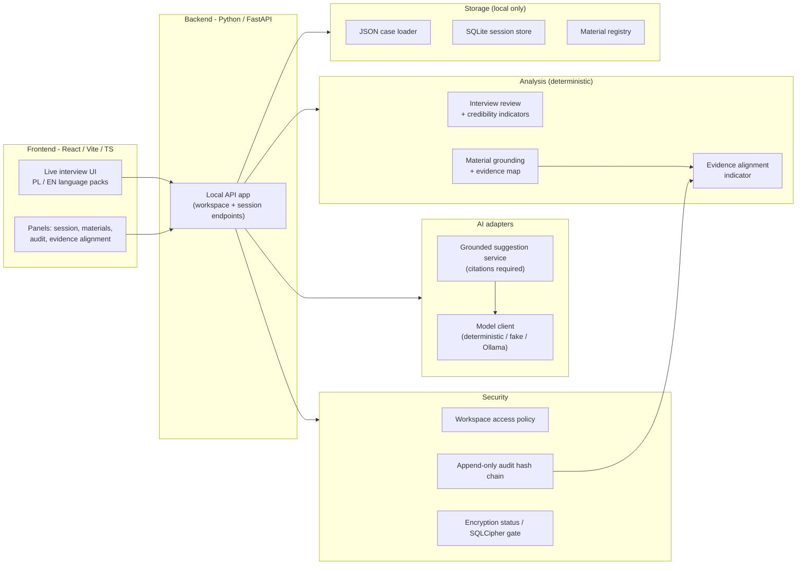
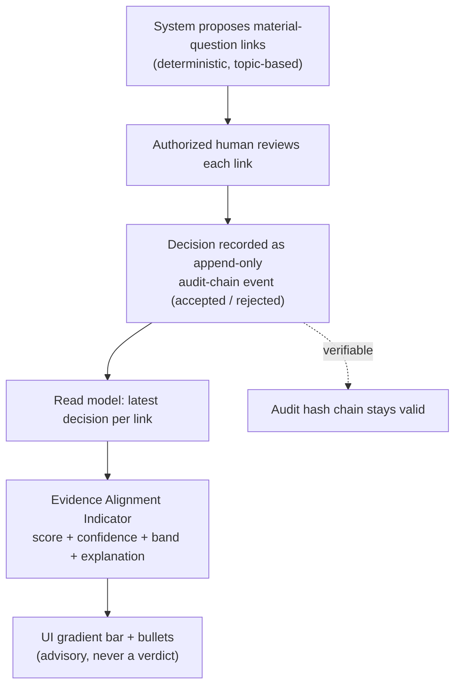
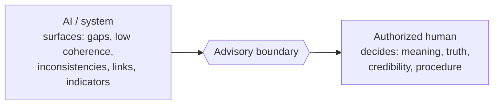

# Architecture and Flow Diagrams

These diagrams describe the local-first prototype. They are versioned as Mermaid so
they stay in sync with the code and review history. AI is an assistant only; the
authorized human remains the decision-maker at every step.

## High-level architecture

## Evidence Alignment data flow

Shows how human decisions, not the machine, drive the advisory indicator.

## Boundary reminder

